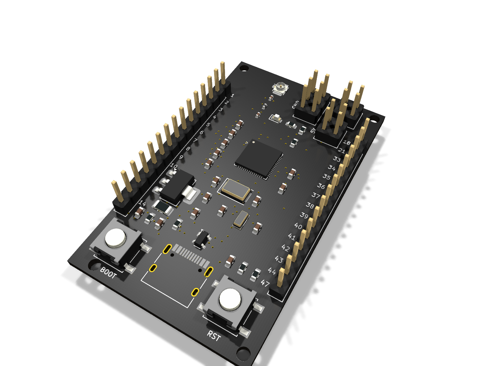
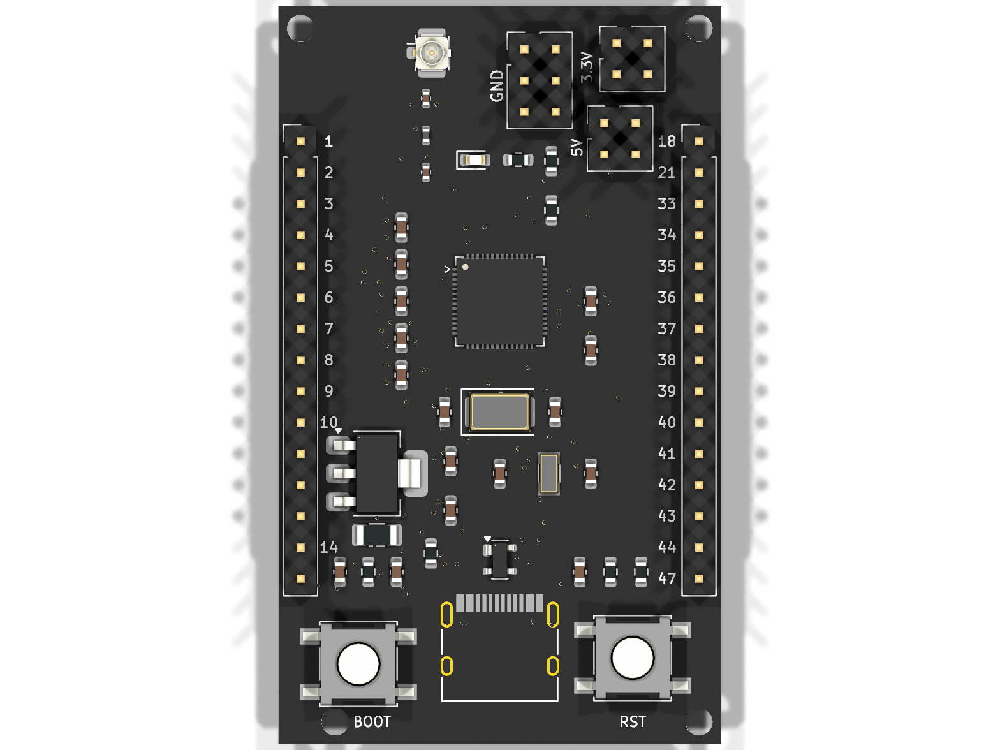
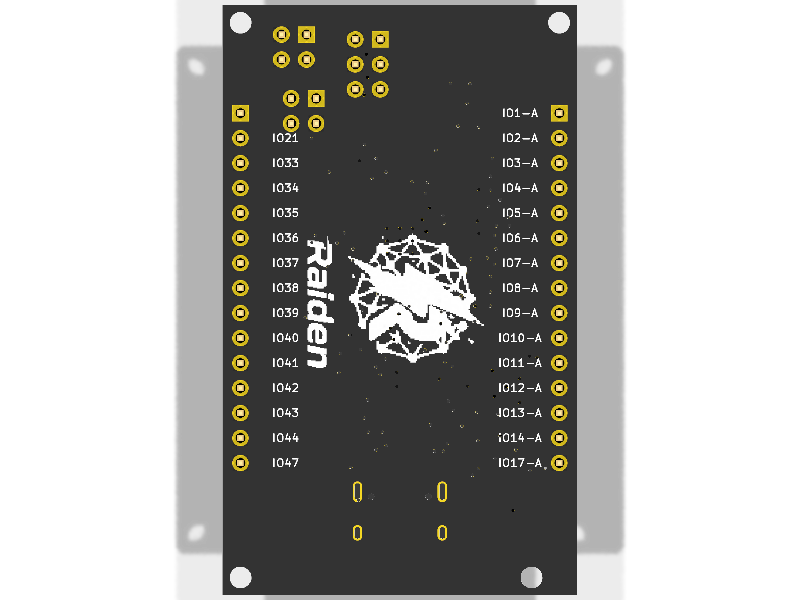

# Raiden S0-1

**Open-hardware ESP32-S3 development board — designed from scratch in KiCad 9.**



## Overview

The Raiden S0-1 is a compact 4-layer devkit built around the **ESP32-S3FN8** (dual-core Xtensa LX7 @ 240 MHz, Wi-Fi + BLE 5, 8 MB embedded flash). Designed, routed and verified entirely by [Raiden Technology](https://github.com/RaidenTechnology).

| | |
|---|---|
| **MCU** | ESP32-S3FN8 (QFN-56, 8 MB flash) |
| **USB** | USB-C (USB 2.0), ESD-protected (PRTR5V0U2X), 5.1 kΩ CC pull-downs |
| **Power** | AZ1117C-3.3 LDO, 750 mA PTC resettable fuse, power LED |
| **RF** | U.FL (IPEX) antenna connector, 50 Ω controlled-impedance feed line with matching network |
| **Clocks** | 40 MHz main crystal (CL = 8 pF) · 32.768 kHz RTC crystal (CL = 12.5 pF) |
| **I/O** | 2 × 15-pin 2.54 mm headers, BOOT + RESET buttons |
| **Board** | 4-layer FR-4, 1.6 mm — Sig / GND / +3V3 / Sig stackup, black soldermask |
| **Mounting** | 4 × M2 holes (NPTH) |

## Board views

| Top | Bottom |
|---|---|
|  |  |

## Verification

- **ERC: 0 errors** — **DRC: 0 errors, 0 unconnected items** (KiCad 9.0.7, `kicad-cli`)
- 5 permanent DRC notices are intentional local footprint overrides (U.FL RF keepout + M2 mounting holes)

## Repository layout

```
hardware/   KiCad 9 project (schematic, PCB, project file)
fab/        Production package: Gerbers (4-layer), drill files,
            BOM + CPL (JLCPCB format), pick-and-place, schematic PDF
images/     kicad-cli 3D renders
```

## Fabrication notes

Full notes in [`fab/README.txt`](fab/README.txt). Highlights:

- Standard 4-layer stackup (JLC7628 or equivalent)
- RF feed line routed for 50 Ω single-ended — ask your fab to adjust trace width to their stackup
- Via-in-pad under the SOT-223 regulator tab: plugged (IPC-4761 Type VI) or at least tented
- QFN-56 (0.4 mm pitch) — stencil and reflow profile matter
- Crystal load capacitance is board-matched: use CL = 8 pF for the 40 MHz crystal (C9/C10 = 10 pF)

## Status

Rev A — design complete and verification-clean; first fabrication run pending.

## License

Hardware licensed under **CERN-OHL-P v2** ([LICENSE](LICENSE)). Use it, modify it, build on it.
